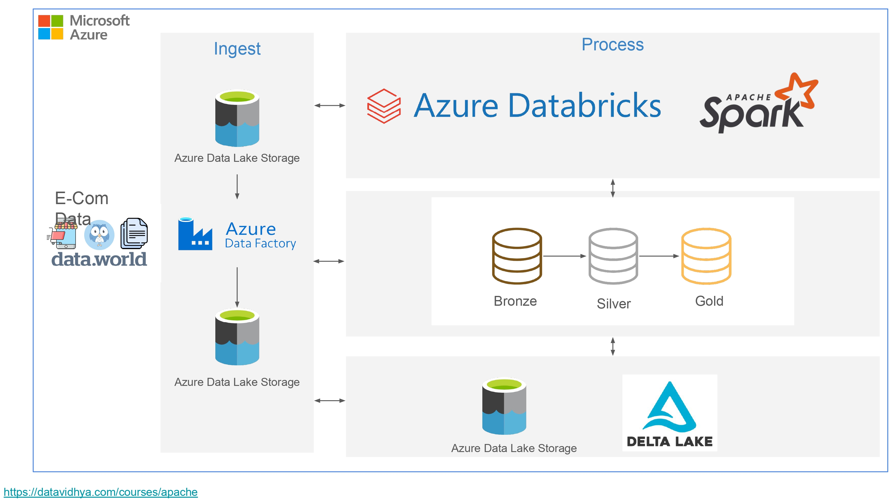

# Data Engineer

#### Technical Skills: Python, SQL, AWS, Azure, Snowflake 

## Education								       		
- M.S.,Business Analytics and Information Systems| The University of South Florida (August 2022- May 2024)	 			        		
- B.S., Electronics and Communications Engineering | GRIET Hyderabad (August-2016- September-2020)

## Work Experience
**Software Engineer @ Capgemini Technology Services (March 2021 - July 2022)**
- Developed and optimized scalable data pipelines, improving processing efficiency by 40%, and reduced data loading times by 34% through advanced ETL processes.
- Implemented data quality checks that decreased anomalies by 25%, and optimized SQL queries to achieve a 20% reduction in processing time.
- Skilled in CI/CD pipeline implementation and management using Jenkins and GitHub Actions, and proficient in writing bash shell scripts and using UNIX utilities.
- Experienced in agile and waterfall methodologies, with a strong foundation in business operations, problem-solving, and collaborative teamwork, ensuring adherence to deadlines and high-quality deliverables.

## Projects
### Spotify ETL Pipeline using AWS and Snowflake
[Publication](https://github.com/bhanu-nithin/Spotify-etl-pipeline)

Developed a data pipeline using the Spotify API to extract, clean, and analyze data . Utilized Jupyter Notebook for initial data extraction and transformation, ensuring data was properly formatted. Stored the processed data in Amazon S3 and employed AWS Lambda functions for automated data transformation. Used Snowflake for data warehousing and implemented Snow pipes to streamline and automate the data loading process. Configured event triggers to manage automatic data transformation and loading. Leveraged Power BI for analytics, providing real-time insights through automated data processing and visualization.

### E-Commerce Automated End-to-End Data Pipeline using Azure Data Factory and Azure Data Bricks
[Publication](https://github.com/bhanu-nithin/E_commerce_Data_Pipeline)

This e-commerce project implements an end-to-end data pipeline using Azure services. Data is ingested into Azure Data Lake Storage Gen2 both manually and automatically via Azure Data Factory (ADF), with ADF triggers automating the conversion of raw data into parquet files. Azure Databricks is used for ETL processing, utilizing the Medallion Architecture (Bronze, Silver, Gold layers) to clean and transform data. The entire process is automated using Databricks Workflows, and the results are queried through the SQL editor for business insights.

